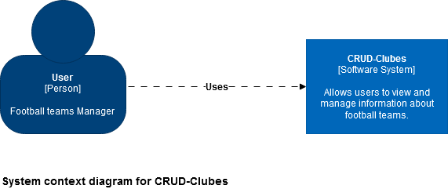
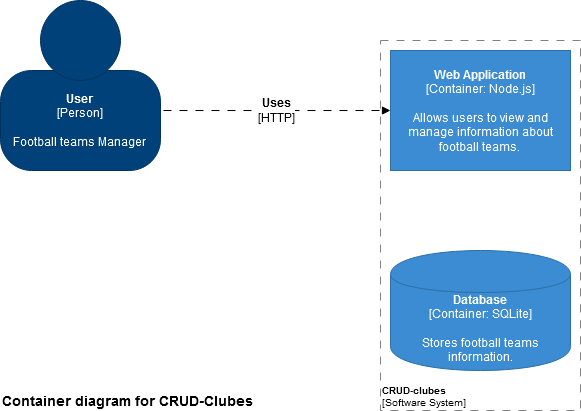
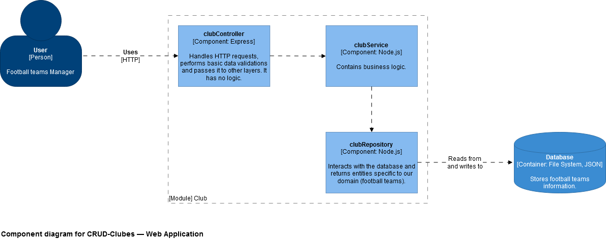

# crud-clubes (SQLite Version)

A CRUD (CREATE, RETRIEVE, UPDATE, DELETE) app of football teams made for [R/Argentina-Programa](https://argentinaprograma.com/) programming course.

JSON version: [Click me](https://github.com/Leonelmarianog/crud-clubes/tree/master)

ORM version: [Click me](https://github.com/Leonelmarianog/crud-clubes/tree/orm-version)

## Software Architecture

### Level 1



### Level 2



### Level 3



## Installation

1 - Run `npm install`.

2 - Copy `.env.dist` and paste it in the root of this project, then rename it to `.env `.

NOTE: Your IDE/Text editor should support Prettier + ESLint, for example, VSCODE. [Setup Guide for VSCODE](https://blog.echobind.com/integrating-prettier-eslint-airbnb-style-guide-in-vscode-47f07b5d7d6a)

## Running

```
npm run dev # Runs project in development mode.
npm run test # Runs jest tests and collects code coverage.
npm run test:dev # Runs jest in watch mode.
```

## Project Structure

Adapted from https://softwareontheroad.com/ideal-nodejs-project-structure/

| Route                               | Description                                                                                    |
| ----------------------------------- | ---------------------------------------------------------------------------------------------- |
| data                                | Contains SQL database                                                                          |
| data/database.db                    | Main database                                                                                  |
| public                              | Contains static files served by the browser. This is where uploaded images are stored.         |
| src                                 | Contains the app.                                                                              |
| src/app.js                          | Entry point of the app.                                                                        |
| src/config                          | App configuration.                                                                             |
| src/config/di.js                    | Dependencies configuration (Dependency Injection).                                             |
| src/modules                         | Contains all the modules of the app.                                                           |
| src/modules/views                   | Contains views common to all modules.                                                          |
| src/modules/views/layouts           | Contains layouts common to all modules.                                                        |
| src/modules/views/layouts/base.html | Base layout to all views.                                                                      |
| src/modules/abstractController.js   | Base abstract controller (No functionality for now)                                            |
| src/modules/club                    | Everything related to football teams.                                                          |
| src/modules/club/controller         | Entry point of the controller, handles HTTP requests.                                          |
| src/modules/club/entity             | Club entity of the domain.                                                                     |
| src/modules/club/mapper             | Maps form data into a Club entity.                                                             |
| src/modules/club/repository         | Interacts with the Data Access Layer and returns entities.                                     |
| src/modules/club/service            | Contains the Business Logic of the app.                                                        |
| src/modules/club/views              | Presentation files (Interface) that are processed server-side (Server-Side-Rendering).         |
| src/modules/club/module.js          | Entry point to the club module. This file is responsible for the initialization of the module. |
